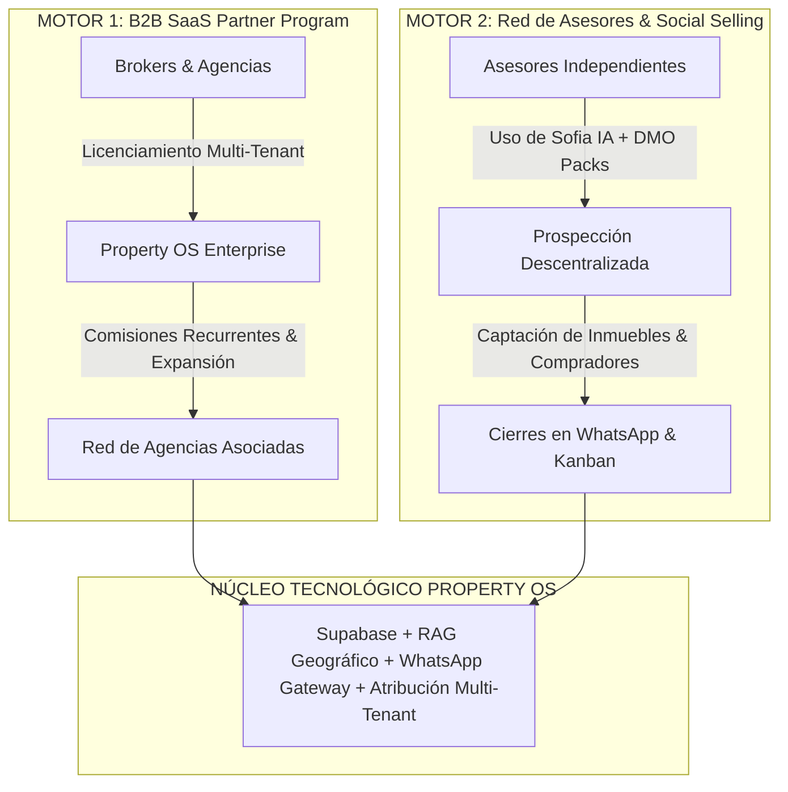

# 🚀 Plan Maestro de Network Marketing & Growth — Property OS

**Versión:** 1.0 — Oficial  
**Orquestador Responsable:** Director (`agents/director/agent.md`)  
**Estatus:** ✅ Listo para Ejecución Operativa  

---

## 🎯 1. Visión Estratégica: El Motor de Crecimiento Dual (Double-Engine)

Property OS combina la potencia de un **SaaS PropTech de clase mundial** (Sofia IA, Telemetría BANT, Multi-Pipeline Kanban, Cotizador Financiero y Auditoría Legal) con la velocidad de escala del **Network Marketing y Social Selling Descentralizado**.



---

## 👥 2. Matriz de Roles y Delegación de Subagentes

| Subagente | Rol en la Campaña | Entregable Principal |
| :--- | :--- | :--- |
| **`creative-scriptwriter`** | Redacción de guiones de prospección no invasiva, storytelling de transformación (El Asesor Tradicional vs. Asesor con IA) y Packs DMO diarios. | `SOCIAL_SELLING_DECK.md` / `DMO_DAILY_PACKS.md` |
| **`video-editor`** | Producción de videos verticales (9:16), comparativas de producto, spots de alto impacto y catálogo de plantillas editables (Canva/CapCut) con QR/Link del socio. | `VIDEO_PRODUCTION_PIPELINE.md` / `REPLICABLE_TEMPLATES_INDEX.md` |
| **`community-ops`** | Automatización de publicaciones, flujos de captura en DMs (ManyChat / WhatsApp API) y enrutamiento con atribución `{ tenant_id, sponsor_id }`. | `DM_CONVERSATION_FLOWS.json` / `COMMUNITY_OPS_SCHEDULE.md` |
| **`growth-analyst`** | Scraping ético de ofertas inmobiliarias del mercado, escucha social de tendencias y auditoría de KPIs de red (duplicación, CPL y retención). | `NETWORK_GROWTH_METRICS.md` / `SCRAPING_INTELLIGENCE.md` |
| **`partner-enablement`** | Onboarding estructurado de nuevos socios/agencias (Plan 90 Días) y supervisión estricta de compliance publicitario y anti-spam. | `PARTNER_ONBOARDING_PLAYBOOK.md` / `COMPLIANCE_GUIDELINES.md` |

---

## 🧲 3. Embudos Duplicables & Lead Magnets de Alta Conversión

Cada asesor y socio de la red dispondrá de 3 embudos replicables con su identificador único de referido (`sponsor_id`):

### 📄 Embudo 1: "Guía Oficial de Crédito de Vivienda Social VIS 2026 + Simulador"
* **Público Objetivo:** Familias y primeros compradores que buscan cuotas mensuales accesibles.
* **Lead Magnet:** Guía PDF con requisitos ASFI y enlace al **Cotizador Hipotecario** de Property OS con tasa preferencial (5.5%).
* **Palabra Clave DM:** `VIVIENDA` o `CALCULAR`.
* **Ruta de Conversión:** DM Instagram/TikTok ➔ Sofia IA califica presupuesto y ciudad ➔ Handoff a WhatsApp del asesor.

### 🏢 Embudo 2: "Reporte ACM de Valor de Metro Cuadrado por Zona"
* **Público Objetivo:** Propietarios de inmuebles en venta o alquiler (Captación).
* **Lead Magnet:** Análisis comparativo de mercado (Santa Cruz: Equipetrol/Urubó; La Paz: Calacoto/Sopocachi; Cochabamba: Norte).
* **Palabra Clave DM:** `PRECIO` o `VALUAR`.
* **Ruta de Conversión:** DM ➔ Sofia IA solicita datos del inmueble ➔ Registro en Pipeline de Captaciones ➔ Asignación al asesor.

### 🤖 Embudo 3: "Masterclass / Demo Interactiva: Automatiza tu Inmobiliaria con IA"
* **Público Objetivo:** Asesores inmobiliarios independientes y directores de agencias (Expansión SaaS).
* **Lead Magnet:** Acceso al **Simulador Visual de Bot & Playground IA** de Property OS.
* **Palabra Clave DM:** `DEMO` o `SISTEMA`.
* **Ruta de Conversión:** Registro en el SaaS con `tenant_id` y atribución de comisión recurrente al sponsor.

---

## 📱 4. Sistema DMO (Daily Method of Operation) — 30 Días para Asesores

Los miembros de la red ejecutan un método de acción diaria de 20 minutos basado en 4 pasos:

```
[08:00 AM] ──► PASO 1: Conectar ──► Publicar Historia de Gancho / Estilo de Vida (Curiosidad)
[12:30 PM] ──► PASO 2: Aportar   ──► Publicar Reel/TikTok Educativo (Ej. Tip Legal de Folio Real)
[18:00 PM] ──► PASO 3: Conversar ──► Responder DMs usando guiones de Social Selling de Sofia IA
[20:30 PM] ──► PASO 4: Seguimiento ── Revisar Kanban y agendar visitas en Google Calendar
```

### Guiones de Prospección Conversacional (Ejemplo de Social Selling)
* **Apertura de Curiosidad (Historia con Sticker de Encuesta):**
  > *"¿Sabías que el 70% de las personas que buscan casa califican para crédito VIS al 5.5% pero creen que necesitan pagar al contado? Comenta **VIS** y te paso la calculadora exacta para simular tu cuota mensual en 10 segundos 👇"*
* **Respuesta en DM (No invasiva):**
  > *"¡Hola [Nombre]! Con gusto te paso el simulador. Para darte el cálculo exacto sin vueltas, ¿estás buscando en Santa Cruz, La Paz o Cochabamba? Así te muestro las opciones viables."*

---

## 🎬 5. Pipeline de Producción Audiovisual (Video Editor & Creative)

### Tipologías de Contenido de Alto Rendimiento

```
├── 1. Hooks de Impacto (0-3s): "Deja de perder ventas a las 2 AM porque no respondes WhatsApp"
├── 2. Comparativas Visuales: "Tu CRM tradicional lleno de hojas de cálculo vs. Property OS en tiempo real"
├── 3. Historias de Éxito: "Cómo captar 5 propiedades en 1 semana usando Auditoría Legal en 1 clic"
└── 4. Micro-Tutoriales: "Cómo generar un Contrato de Reserva formal con arras en 30 segundos"
```

### Protocolo de Plantillas Editables Duplicables
1. **Formato Base:** Proyectos editables en CapCut y Canva con tipografía **Poppins** y acentos en **Champagne Gold** (`#D4AF37`).
2. **Zona de Reemplazo:** Espacio reservado inferior (tercio inferior) para colocar:
   * Foto y nombre del asesor / agencia asociada.
   * Enlace corto / Código QR personalizado (`propertyos.app/ref/{{sponsor_id}}`).

---

## 🛡️ 6. Código de Compliance & Protección de Marca (Partner Enablement)

Para garantizar la longevidad y reputación de Property OS y sus socios:

1. 🚫 **Prohibición de Promesas Irreales:** Prohibido publicar frases como *"Gana $10,000 en tu primera semana"* o *"Ventas automáticas sin esfuerzo"*. Se comunica **eficiencia operativa y tecnología profesional**.
2. 🚫 **Cero Spam en Redes:** Prohibido el envío masivo de enlaces no solicitados en comentarios o DMs fríos. Toda conversación inicia con consentimiento previo o interacción con contenido de valor.
3. ⚖️ **Transparencia Legal:** En el módulo inmobiliario, se enfatiza la verificación de Folio Real, Impuestos al día y Catastro aprobado para blindar a los clientes.
4. 🔒 **Aislamiento Multi-Tenant Estricto:** Ningún asesor o agencia puede ver o acceder a la base de datos de leads de otra organización.

---

## 📊 7. Tablero de KPIs de Crecimiento & Atribución (Growth Analyst)

```
┌──────────────────────────────────────────────────────────────────────────┐
│                   TELEMETRÍA DE RED — PROPERTY OS                        │
├──────────────────────────┬───────────────────────────┬───────────────────┤
│ MÉTRICA CLAVE            │ META MENSUAL              │ ACCIÓN CORRECTIVA │
├──────────────────────────┼───────────────────────────┼───────────────────┤
│ Tasa de Duplicación DMO  │ > 65% de la red activa    │ Reforzar Onboarding│
│ Tasa de Respuesta DM     │ < 2 minutos (Sofia IA)    │ Ajustar Webhook   │
│ Costo por Lead (CPL)     │ < $0.80 USD               │ Iterar Hooks (3s) │
│ Conversión a Visita      │ > 25% de Leads Calificados│ Ajustar Scoring   │
│ Retención de Agencias    │ > 92% mensual (MRR)       │ Soporte & CS Ops  │
└──────────────────────────┴───────────────────────────┴───────────────────┘
```

---

## 🗓️ 8. Roadmap de Ejecución a 90 Días

```
[MES 1: Fundaciones & Red Semilla]
├── Despliegue de los 3 Embudos Replicables y packs DMO iniciales.
├── Onboarding de los primeros 15 Asesores/Agencias Embajadoras.
└── Calibración de Sofia IA con respuestas automáticas por palabra clave.

[MES 2: Duplicación & Pauta de Rendimiento]
├── Activación masiva de contenido vertical en TikTok/Reels/Shorts.
├── Scraping de oportunidades de mercado para alimentar el RAG Inmobiliario.
└── Lanzamiento del Concurso de Reconocimiento y Récord de Cierres en Kanban.

[MES 3: Escala & Expansión Regional]
├── Automatización total de licencias SaaS para agencias con onboarding autónomo.
├── Integración de métricas de atribución avanzada de comisiones en el panel SuperAdmin.
└── Consolidación del reporte ejecutivo final de campaña.
```

---

## ✅ Conclusión del Director

Este plan articula el ecosistema tecnológico de Property OS con una máquina de distribución descentralizada, profesional y duplicable. Cada subagente cuenta con su responsabilidad delimitada y protocolos de handoff auditados.
